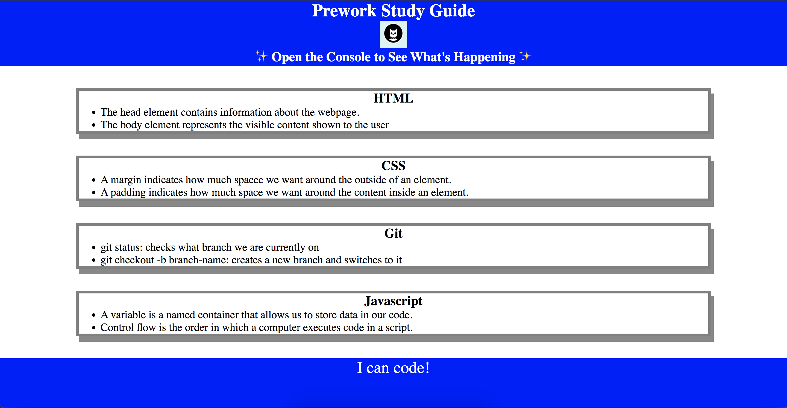

# Prework-Study-Guide-Webpage

## A study guide for course pre-work.
This Prework Study Guide was created to boot camp students who were going through the Prework. Students can review the notes in each section. This serves a purpose to help students understand the basics of coding with quick and clear understanding of what each fundamental element consist of such as HTML, CSS, Git, & JavaScript. This has helped me learn how to build this webpage and what went into it behind the scenes. 

## Installation

N/A

## Usage

To use this Prework Study Guide, you can review the notes in each section. For suggestions on what to study first, open the Chrome DevTools by pressing Command+Option+I (macOS) or Control+Shift+I (Windows). A console panel should open either below or to the side of the webpage in the browser. There you will see a list of topics we learned from the prework along with a suggestion on which topic to study first.

## Credits

N/A

## License

Please refer to the LICENSE in the repo.